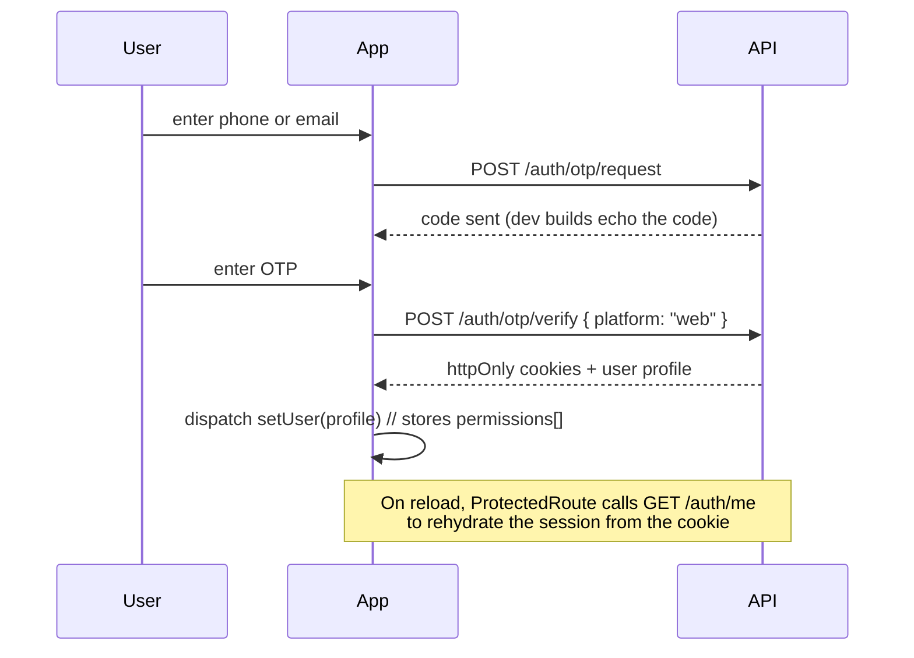
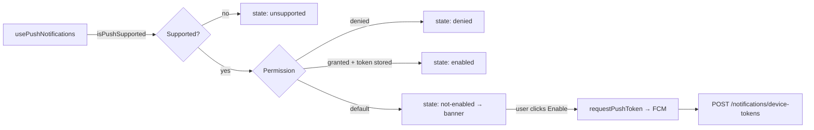

# StockMate — Web Client

> bilingual (Arabic / English) React dashboard for hospital inventory management and clinical operations.

[](https://react.dev/)
[](https://www.typescriptlang.org/)
[](https://vitejs.dev/)
[](https://redux-toolkit.js.org/rtk-query/overview)
[](https://tailwindcss.com/)
[](#license)

---

## Table of Contents

- [Overview](#overview)
- [Key Features](#key-features)
- [Tech Stack](#tech-stack)
- [Screens & Modules](#screens--modules)
- [Project Structure](#project-structure)
- [Getting Started](#getting-started)
- [Environment Variables](#environment-variables)
- [Architecture](#architecture)
  - [Data layer — RTK Query](#data-layer--rtk-query)
  - [Auth flow](#auth-flow)
  - [Permission-aware routing](#permission-aware-routing)
  - [Department scoping](#department-scoping)
  - [Loading, empty & error states](#loading-empty--error-states)
- [Design System](#design-system)
- [Internationalisation & RTL](#internationalisation--rtl)
- [Push Notifications](#push-notifications)
- [Shared Components](#shared-components)
- [Adding a New Feature](#adding-a-new-feature)
- [Related Repositories](#related-repositories)

---

## Overview

This is the web front end for **StockMate** — a hospital inventory and clinical-operations platform. It covers everything from receiving a supplier shipment into the central warehouse, to a doctor writing a prescription, to the pharmacy dispensing it, to disposing of expired stock.

The UI is fully **bilingual (Arabic / English)** with proper RTL support, **theme-customisable** at runtime (primary colour, font size, border radius, density, dark mode), and **permission-aware** — every route, nav item and action button is gated by the effective permissions returned by the API.

---

## Key Features

- 🌍 **Arabic + English** with instant switching, logical CSS properties (`ps-*`, `pe-*`, `inset-e-*`) and RTL-aware layouts.
- 🎨 **Live theming** — pick a primary colour, font size, corner radius, density and dark mode; persisted to `localStorage` via Zustand.
- 🔐 **Permission-driven UI** — `PermissionRoute` guards routes, `AppPermissionGate` hides actions, and the sidebar filters itself.
- 🏢 **Smart department selector** — automatically resolves to the user's own department when they're scoped, or offers a picker when they're not, per page context.
- 📊 **Reports with charts + Excel export** — Recharts visualisations with one-click `.xlsx` download.
- 🔔 **Web push** via Firebase Cloud Messaging, with a dismissible permission banner and foreground message handling.
- 🖨️ **Printable patient history** — a dedicated A4-styled print route with auto-triggered print dialog.
- 🤖 **Floating AI assistant** — chat widget available on every screen.
- 📱 **Responsive** — collapsible desktop sidebar plus a mobile drawer.
- ⚡ **Code-split routes** — every page is lazy-loaded, with a chunk-load error boundary that auto-reloads after a deploy.
- 🧭 **Consistent async UX** — skeletons on first load, dimmed content plus an "Updating…" badge on refetch, dedicated empty/error/forbidden states.

---

## Tech Stack

| Concern      | Choice                                                                                       |
| ------------ | -------------------------------------------------------------------------------------------- |
| Framework    | React 19 + TypeScript                                                                        |
| Build tool   | Vite                                                                                         |
| Routing      | React Router (data router, lazy routes)                                                      |
| Server state | Redux Toolkit **RTK Query**                                                                  |
| Client state | Redux slice (auth) + **Zustand** (theme, UI)                                                 |
| Styling      | Tailwind CSS v4 (`@theme inline` + CSS variables)                                            |
| Primitives   | Radix UI (Dialog, Select, Popover, Tabs, Switch, Checkbox, Tooltip, Sheet, Separator, Label) |
| Variants     | `class-variance-authority` + `clsx` + `tailwind-merge`                                       |
| Icons        | `lucide-react`                                                                               |
| Charts       | Recharts                                                                                     |
| i18n         | `i18next` + `react-i18next`                                                                  |
| Dates        | `date-fns`                                                                                   |
| Toasts       | `sonner` (driven by a Redux middleware)                                                      |
| Push         | Firebase JS SDK (`firebase/messaging`)                                                       |

---

## Screens & Modules

| Area                   | Pages                                                                                                                                                    |
| ---------------------- | -------------------------------------------------------------------------------------------------------------------------------------------------------- |
| **Dashboard**          | KPI cards, live queue preview, permission-filtered quick links                                                                                           |
| **Patients**           | List, detail (visits + prescriptions tabs), printable history, register/edit                                                                             |
| **Queue**              | Live + history tabs, quick patient find/register, select, release, remove, remove-all                                                                    |
| **Consultation**       | Patient picker, clinical notes, diagnosis, multi-prescription builder with cycles                                                                        |
| **Visits**             | List with filters, visit detail                                                                                                                          |
| **Prescriptions**      | List with status + cycle-status filters, detail with cycle progress bar, cancel                                                                          |
| **Pharmacy**           | Dispense queue, national-ID / family-book lookup, dispense dialog with remaining-per-cycle                                                               |
| **Inventory**          | Live stock (expandable batch cards, min/max + expiry badges), batches, transactions, adjustments, consumption (FEFO result view), stock counts + detail  |
| **Refills**            | Requests with stepper + approval actions, ship-delivery batch picker, deliveries, delivery confirmation, periodic schedules                              |
| **Purchasing**         | Purchase requests with stepper + approvals, receipts list, multipart receipt creation with image upload, receipt detail with lightbox & image management |
| **Disposal**           | Candidates by department, transfers, transfer detail with confirm/cancel                                                                                 |
| **Disposal Sales**     | Sale requests, creation from warehouse batches, approve/reject, image upload, confirm                                                                    |
| **Catalog**            | Products / Variants / Units / Categories tabs                                                                                                            |
| **Suppliers**          | List, detail with linked variants                                                                                                                        |
| **Stock Settings**     | Bulk creation with per-item results, min/max editing, activation toggles                                                                                 |
| **Departments**        | List with filters, create, edit, manager assignment                                                                                                      |
| **Users & RBAC**       | Users list, user detail (profile / permissions matrix / sessions), roles + permission matrix                                                             |
| **Reports**            | Inventory movement, adjustments, patient visits — each with KPIs, trend chart, department breakdown, table and Excel export                              |
| **Settings & Profile** | Theme customisation, language, own profile, own sessions                                                                                                 |

---

## Project Structure

```
src/
├── main.tsx                   # Entry: applies persisted theme, mounts <App/>
├── App.tsx                    # RouterProvider + Toaster
├── index.css                  # Tailwind v4 theme tokens, dark mode, RTL, scrollbars
│
├── api/                       # One RTK Query slice per backend domain
│   ├── baseApi.ts             # fetchBaseQuery + 401 refresh-and-retry + tagTypes
│   ├── auth.api.ts            assistant.api.ts   catalog.api.ts
│   ├── departments.api.ts     destinations.api.ts disposal.api.ts
│   ├── disposalSales.api.ts   inventory.api.ts    notifications.api.ts
│   ├── patients.api.ts        pharmacy.api.ts     prescriptions.api.ts
│   ├── purchasing.api.ts      queue.api.ts        rbac.api.ts
│   ├── refills.api.ts         reports.api.ts      sessions.api.ts
│   ├── suppliers.api.ts       users.api.ts        visits.api.ts
│
├── app/
│   ├── store.ts               # configureStore + baseApi middleware + toastMiddleware
│   └── hooks.ts               # Typed useAppDispatch / useAppSelector
│
├── components/
│   ├── primitive/             # shadcn-style Radix wrappers (button, dialog, select…)
│   └── shared/                # App-level building blocks (see below)
│
├── features/                  # Feature-first page modules
│   ├── assistant/  auth/  catalog/  dashboard/  department-queue/
│   ├── department-refills/  departments/  destinations/  disposal/
│   ├── disposal-sales/  inventory/  medical-visits/  notifications/
│   ├── patients/  pharmacy/  prescriptions/  purchasing/  rbac/
│   ├── reports/  settings/  stock-settings/  suppliers/  users/
│
├── hooks/
│   ├── useDebouncedValue.ts   # Search-input debouncing
│   ├── usePaginatedOptions.ts # Infinite-scroll option source for ComboboxSelect
│   └── usePermission.ts       # usePermission / useHasAny / useHasAll / useCurrentUser
│
├── lib/
│   ├── apiTypes.ts            # All backend DTO types (single source of truth)
│   ├── enums.ts               # Status/type unions mirroring the Prisma enums
│   ├── permissions.ts         # PERMISSIONS constant (mirrors the backend)
│   ├── roleConstants.ts       formatters.ts   getErrorStatus.ts
│   ├── firebase.ts            # FCM init, token request, foreground listener
│   ├── toastMiddleware.ts     # Auto-toasts mutation results (with a silent list)
│   └── utils.ts               # cn() = clsx + tailwind-merge
│
├── routes/
│   ├── router.tsx             # Lazy routes + error boundary + 403/404
│   ├── navConfig.ts           # Sidebar sections & per-item permissions
│   ├── ProtectedRoute.tsx     # Bootstraps the session via /auth/me
│   └── PermissionRoute.tsx    # Route-level permission gate
│
└── stores/
    ├── theme.store.ts         # Persisted theme (colour, size, radius, density, lang)
    └── ui.store.ts            # Sidebar state + list-page store factory
```

---

## Getting Started

### Prerequisites

- **Node.js** ≥ 20
- A running **StockMate Backend** (default `http://localhost:3000/api`)
- A Firebase web app (only needed for push notifications)

### Installation

```bash
git clone https://github.com/hamedzaher999/Stock-Mate-Frontend.git
cd Stock-Mate-Frontend.git

npm install

npm run dev
```

Open **http://localhost:5173**.

> The backend must include your dev origin in its `CORS_ORIGIN` list, since authentication relies on `credentials: "include"` cookies.

### Service worker for push

Push notifications require `public/firebase-messaging-sw.js` to exist and be served from the site root.

---

## Environment Variables

```dotenv
# API
VITE_API_URL=http://localhost:3000/api

# Firebase (web push)
VITE_FIREBASE_API_KEY=
VITE_FIREBASE_AUTH_DOMAIN=
VITE_FIREBASE_PROJECT_ID=
VITE_FIREBASE_STORAGE_BUCKET=
VITE_FIREBASE_MESSAGING_SENDER_ID=
VITE_FIREBASE_APP_ID=
VITE_FIREBASE_VAPID_KEY=
```

`VITE_API_URL` falls back to the hosted staging API if unset — always set it explicitly in production.

---

## Architecture

### Data layer — RTK Query

A single `baseApi` is created once and every domain **injects endpoints** into it. That keeps one cache, one middleware and one coherent tag graph.

```ts
export const catalogApi = baseApi.injectEndpoints({
  endpoints: (builder) => ({
    getProducts: builder.query<
      ApiResponse<PaginatedResult<Product>>,
      ProductsQuery
    >({
      query: (params) => ({ url: "/catalog/products", params: params ?? {} }),
      providesTags: ["Product"],
    }),
    createProduct: builder.mutation<ApiResponse<Product>, CreateProductBody>({
      query: (body) => ({ url: "/catalog/products", method: "POST", body }),
      invalidatesTags: ["Product"],
    }),
  }),
});
```

Cross-domain invalidation is where this really pays off — confirming a delivery invalidates `Delivery`, `RefillRequest` **and** `LiveStock`, so the inventory screen is correct the moment you navigate to it.

#### Automatic token refresh

`baseQueryWithReauth` intercepts any `401`, fires a **single shared** `POST /auth/refresh` (concurrent 401s await the same promise), retries the original request, and only logs the user out if the retry also fails.

#### Toast middleware

`toastMiddleware` listens for fulfilled/rejected **mutations** and shows a `sonner` toast using the backend's `message` field. Endpoints listed in `SILENT_ENDPOINTS` opt out — those screens render inline success/error UI instead.

### Auth flow



The login page also ships a **Quick login** panel listing demo accounts per role, which speeds up manual QA.

### Permission-aware routing

```tsx
{
  element: <PermissionRoute permission={PERMISSIONS.VIEW_INVENTORY} />,
  children: [
    { path: "/inventory/live-stock", element: wrap(LiveStockPage) },
    { path: "/inventory/batches",    element: wrap(BatchesPage) },
  ],
}
```

`PermissionRoute` supports a single `permission` or an `anyOf` array and redirects to `/403`. The same metadata drives `navConfig.ts`, so unauthorised pages simply don't appear in the sidebar. Inside a page, wrap individual actions:

```tsx
<AppPermissionGate permission={PERMISSIONS.CONFIRM_DEPARTMENT_DELIVERY}>
  <Button onClick={openConfirm}>Confirm delivery</Button>
</AppPermissionGate>
```

### Department scoping

Most inventory and clinical pages are department-scoped server-side. `useDepartmentSelector(context)` calls `GET /departments/selectable?context=…` and returns:

```ts
const { scoped, departments, resolved, noAccess, isLoading } =
  useDepartmentSelector("stock");
```

| Result                             | UI behaviour                                                                        |
| ---------------------------------- | ----------------------------------------------------------------------------------- |
| `resolved` (scoped to exactly one) | Renders a read-only department label                                                |
| `!scoped`                          | Renders an "All departments" dropdown                                               |
| `noAccess`                         | Renders an empty state explaining the user isn't assigned to an eligible department |

Supported contexts: `stock`, `batches`, `queue`, `refill-requests`, `periodic-schedules`, `disposal`, `stock-settings`.

### Loading, empty & error states

A deliberate, consistent async language across the whole app:

| State                             | Treatment                                                                                                                                               |
| --------------------------------- | ------------------------------------------------------------------------------------------------------------------------------------------------------- |
| First load (`isLoading`)          | Skeleton placeholders sized like the real content                                                                                                       |
| Background refetch (`isFetching`) | Existing content dimmed to 60 % + pointer-events off, with a floating "Updating…" pill                                                                  |
| Empty                             | `AppEmptyState` with icon, title and description                                                                                                        |
| Error                             | `AppErrorState` with a **Retry** button                                                                                                                 |
| Forbidden (403)                   | `AppErrorState` detects the status and swaps in a shield icon, a permission-specific message, and **hides retry** (permissions won't change on refetch) |

---

## Design System

### Tokens

All colours, radii and typography live as CSS variables in `index.css` and are exposed to Tailwind via `@theme inline`:

```css
:root {
  --background: #f5f6fa;
  --foreground: #111827;
  --card: #ffffff;
  --primary: #c8102e;
  --muted: #f0f1f6;
  --border: #e2e4ec;
  --success: #16a34a;
  --warning: #d97706;
  --danger: #c8102e;
  --info: #2563eb;
  --radius: 0.5rem;
  --font-size-base: 14px;
}
.dark {
  /* full dark palette override */
}
```

`useThemeStore.applyToRoot()` writes user preferences straight onto `document.documentElement`, so theme changes are instant and require no re-render.

### Components

`components/primitive/` holds thin, styled Radix wrappers (`Button`, `Dialog`, `Select`, `Sheet`, `Tabs`, `Switch`, `Checkbox`, `Tooltip`, `Card`, `Badge`, `Input`, `Textarea`, `Label`, `Skeleton`, `Separator`). Variants are defined with `cva`:

```tsx
<Button variant="destructive" size="sm" loading={isSaving}>Delete</Button>
<Badge variant="warning">Expiring soon</Badge>
```

`StatusBadge` centralises every status → colour mapping in the system (`purchaseRequest`, `refillRequest`, `queue`, `visit`, `prescription`, `prescriptionCycle`, `disposalTransfer`, `disposalSaleRequest`, `transaction`, …) so a `preparing` request looks identical everywhere.

---

## Internationalisation & RTL

- Namespaced translations: `common`, `nav`, `auth`, `status`, `catalog`, `inventory`, `refills`, `purchasing`, `disposal`, `patients`, `queue`, `visits`, `prescriptions`, `pharmacy`, `users`, `sessions`, `rbac`, `reports`, `settings`, `dashboard`, `notifications`, `assistant`, `suppliers`.
- Always pass a `defaultValue` so a missing key degrades to readable English instead of a raw key:

  ```tsx
  t("table.updating", { defaultValue: "Updating…" });
  ```

- Enum labels are resolved through the `status` namespace, e.g. `t("status:refillRequest.pending_manager_approval")`.
- Switching language updates both `i18next` and `useThemeStore`, and the app uses **logical** Tailwind utilities (`ps-`, `pe-`, `ms-`, `me-`, `start-`, `end-`, `inset-e-`) so mirroring is automatic.

---

## Push Notifications



- The hook **never auto-prompts**. It only re-registers silently if permission was already granted previously.
- `PushPermissionBanner` is dismissible and remembers the dismissal in `localStorage`.
- `ShellLayout` subscribes to foreground FCM messages, invalidates the `Notification` and `UnreadCount` tags, and raises a native notification.
- The bell in the top bar polls unread count and the latest notifications every 30 s.

---

## Shared Components

| Component                            | Purpose                                                                                  |
| ------------------------------------ | ---------------------------------------------------------------------------------------- |
| `AppDataTable`                       | Generic typed table: `ColumnDef<T>[]`, skeletons, refetch overlay, row click, pagination |
| `AppPagination`                      | First / prev / next / last with an "showing X–Y of Z" label                              |
| `AppPageHeader`                      | Title + subtitle + right-aligned actions                                                 |
| `AppSearchInput`                     | Debounce-friendly search field with icon                                                 |
| `AppEmptyState` / `AppErrorState`    | Consistent empty + error (and 403) presentation                                          |
| `AppQueryState`                      | Wraps children with loading / error / empty / refetching logic                           |
| `AppPermissionGate`                  | Conditional rendering by permission                                                      |
| `DepartmentSelector`                 | Context-aware department picker (+ `useDepartmentSelector`)                              |
| `ComboboxSelect`                     | Searchable select with infinite scroll for paginated endpoints                           |
| `ConfirmActionDialog`                | Reusable destructive-action confirmation                                                 |
| `QuantityMismatchDialog`             | Warns when confirmed quantities differ from shipped, with a signed delta per line        |
| `PatientQuickFindPanel`              | Scan/ID lookup + name search + inline patient registration                               |
| `SessionsList`                       | Device sessions with platform icons, current/expired badges and revoke                   |
| `ReportShell`                        | Shared report layout: filters, KPI cards, chart, breakdown, table, export                |
| `Sidebar` / `Topbar` / `ShellLayout` | App chrome, mobile drawer, notification bell, assistant widget                           |

---

## Adding a New Feature

1. **Types** — add the response shapes to `src/lib/apiTypes.ts`.
2. **API slice** — create `src/api/<domain>.api.ts`, inject endpoints into `baseApi`, and register any new tag in `baseApi.tagTypes`.
3. **Permission** — add the code to `src/lib/permissions.ts` (must match the backend exactly).
4. **Page** — create `src/features/<domain>/pages/<Name>Page.tsx` using `AppPageHeader` + `AppDataTable` + the shared state components.
5. **Route** — lazy-import it in `src/routes/router.tsx` and wrap it in a `PermissionRoute`.
6. **Navigation** — add an entry to `src/routes/navConfig.ts` with the right `permission` or `anyOf`.
7. **Translations** — add keys to both the `en` and `ar` bundles.

---

## Related Repositories

| Repo                  | Description                           | link                                                                         |
| --------------------- | ------------------------------------- | ---------------------------------------------------------------------------- |
| **stockmate-backend** | NestJS + Prisma REST API              | [GitHub Repository](https://github.com/hamedzaher999/Stock-mate-Backend.git) |
| **stockmate-chatbot** | NestJS RAG assistant (pgvector + LLM) | [GitHub Repository](https://github.com/hamedzaher999/StockMate-Chatbot.git)  |

---
